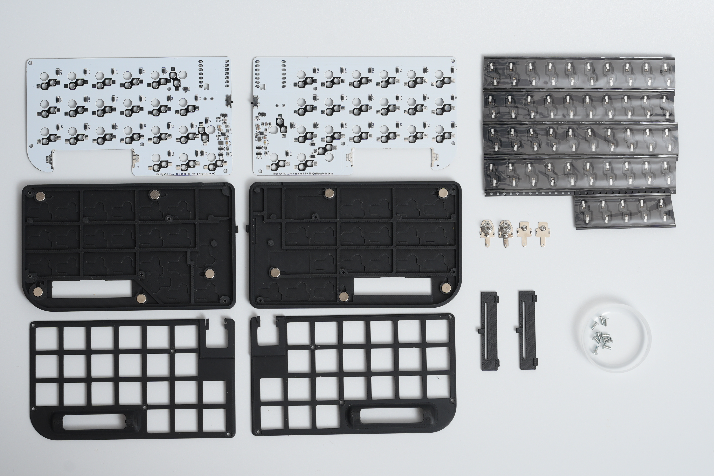
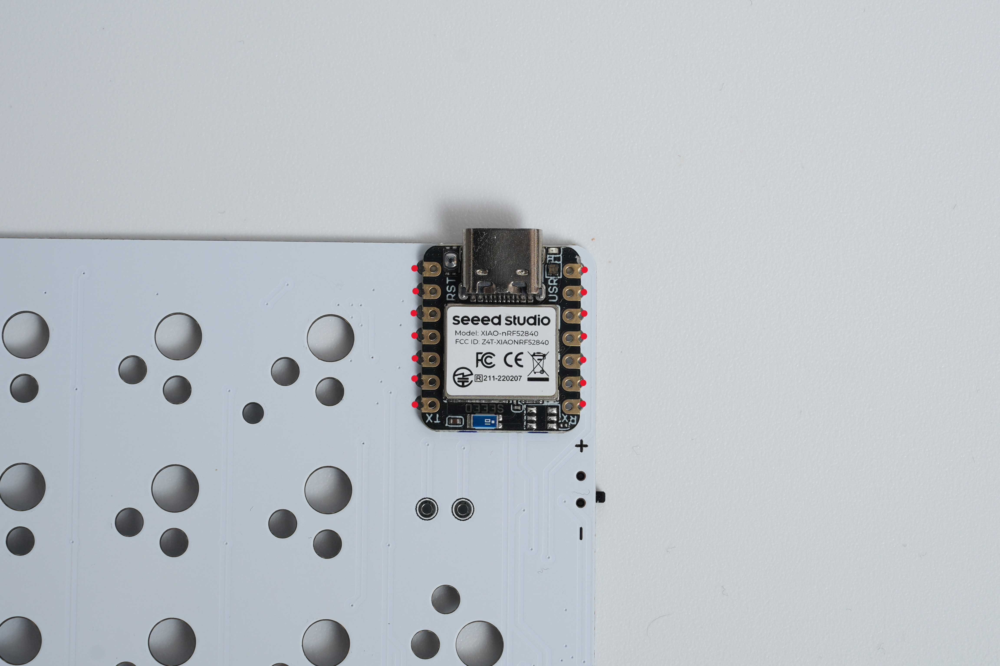
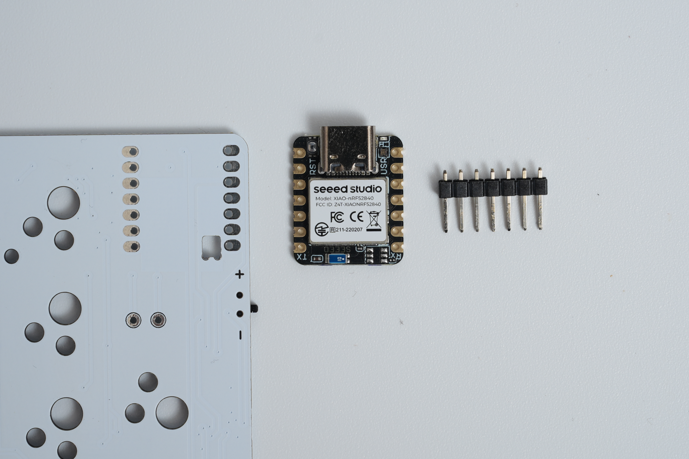
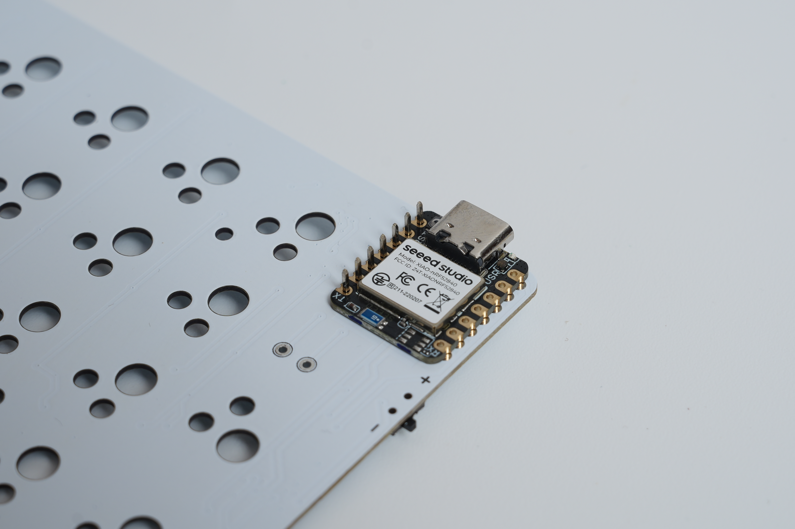
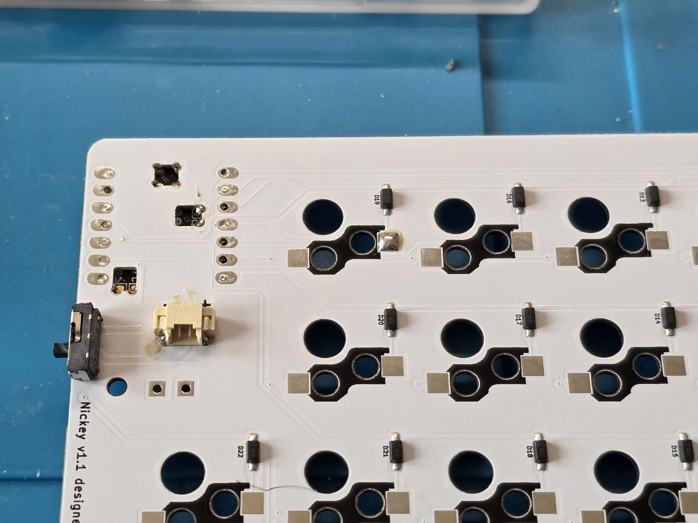
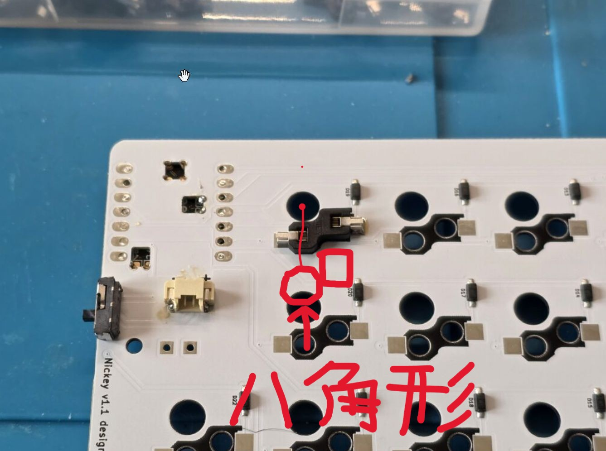
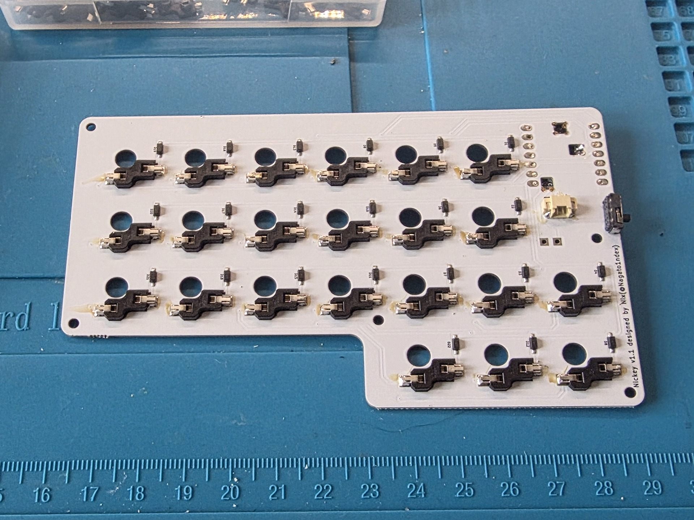
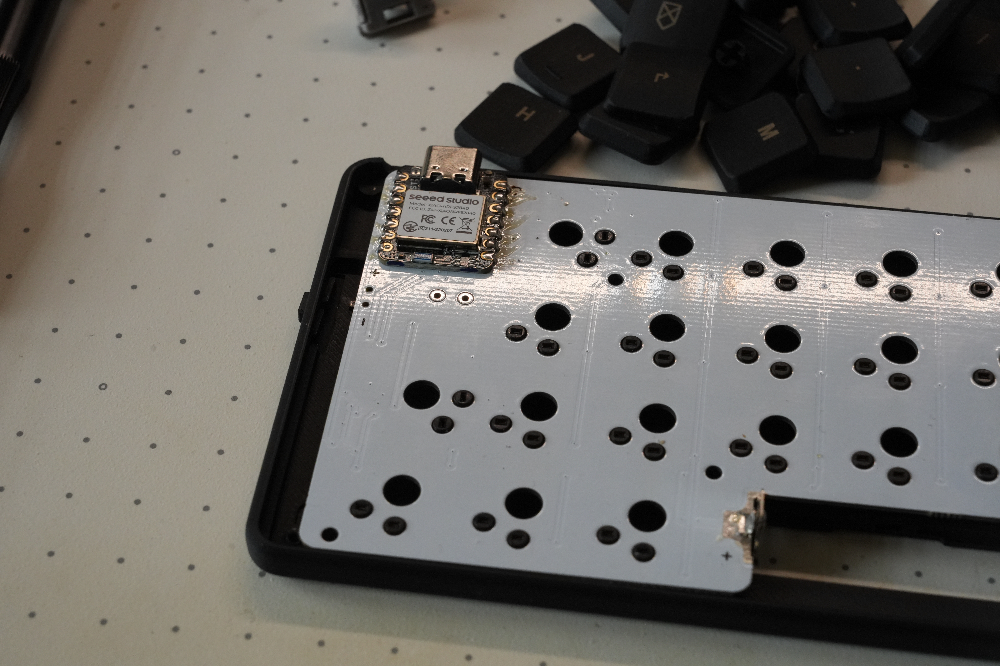
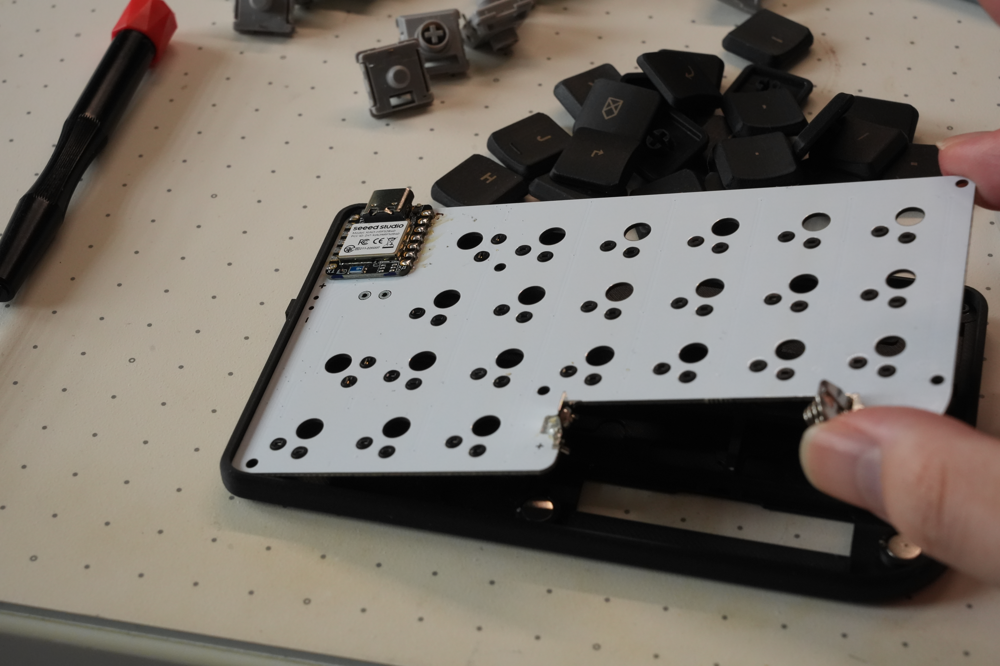
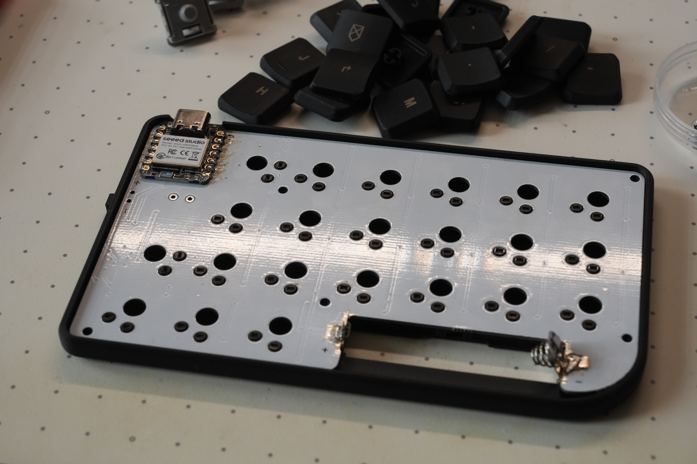

# Nickey44A ビルドガイド

このページでは、単4電池で動作する完全ワイヤレス分割キーボード「Nickey44A」の組み立てから、Firmwareの書き込み、Bluetoothペアリング、動作確認までを説明します。

> Nickey44AはNickey44と多くの工程が共通ですが、電源・電池端子・ケースの組み立て方法は異なります。このページの手順に従ってください。

<nav class="toc-panel" data-toc aria-label="ページ内目次">
  
目次

  <ol class="toc-list" data-toc-list></ol>
</nav>

<aside class="toc-panel side-toc" data-toc aria-label="サイド目次">
  
目次

  <ol class="toc-list" data-toc-list></ol>
</aside>

## ⌨️ Nickey44Aについて

Nickey44Aの主な特徴は次のとおりです。

- Bluetooth対応
- 44キーのオーソリニア配列
- Choc v2対応のロープロファイル設計
- 17 mmの狭ピッチ
- ZMK Firmware
- 単4電池で動作する薄型の左右分割デザイン

組み立ては、おおむね次の順番で進めます。

1. 部品を確認する
2. XIAOとソケットをはんだ付けする
3. 単4電池端子をはんだ付けする
4. ケースへ組み込む
5. Firmwareを書き込む
6. 単4電池を装着する
7. Bluetooth接続とキー入力を確認する

## 🧩 部品一覧

組み立てる前に、部品の種類と数量を確認してください。

| 部品 | 数量 | キット付属 | 備考 |
| --- | ---: | :---: | --- |
| Nickey44A PCB（左・右） | 各1 | ✅ | |
| M2 ネジ 5 mm | 10 | ✅ | ケース固定に使用 |
| Choc v2 ホットスワップソケット | 44 | ✅ | |
| 単4電池用マイナス端子 | 2 | ✅ | |
| 単4電池用プラス端子 | 2 | ✅ | |
| 6*3mm マグネット | 10 | ✅ | |
| Seeed Studio XIAO nRF52840 | 2 | ❌ | **Plusではなく無印を使用** |
| 17 mmピッチ対応キーキャップ | 44 | ❌ | |
| Choc v2キースイッチ | 44 | ❌ | |
| ボトムケース | 各1 | ✅ | |
| トッププレート | 各1 | ✅ | |
| 電池カバー | 各1 | ✅ | |

  
ⓘ 重要

  
Seeed Studio XIAO nRF52840 Plusでは動作しません。必ず無印のSeeed Studio XIAO nRF52840を用意してください。

### 別途必要な部品（必須）

- [Seeed Studio XIAO nRF52840](https://shop.beekeeb.jp/products/seeed-studio-xiao-nrf52840-xiao-ble) × 2（**Plusではなく無印**）
- [Choc v2キースイッチ](https://shop.beekeeb.jp/collections/choc-v2-%E3%82%AD%E3%83%BC%E3%82%B9%E3%82%A4%E3%83%83%E3%83%81) × 44
- [Choc v2／MXステム対応・狭ピッチキーキャップ](https://shop.beekeeb.jp/collections/%E3%82%AD%E3%83%BC%E3%82%AD%E3%83%A3%E3%83%83%E3%83%97-mx-%E3%83%AD%E3%83%BC%E3%83%97%E3%83%AD%E3%83%95%E3%82%A1%E3%82%A4%E3%83%AB-%E7%8B%AD%E3%81%84%E3%83%94%E3%83%83%E3%83%81) × 44
- 単4電池 × 2

### キット付属品の入手先（紛失・破損・個別調達用）

- [単4電池用マイナス端子（MonotaRO）](https://www.monotaro.com/p/8835/2521/)
- [単4電池用プラス端子（MonotaRO）](https://www.monotaro.com/p/8835/2512/)
- [Choc v2 ホットスワップソケット](https://shop.beekeeb.jp/products/kailh-choc-hotswap-sockets)
- [M2平ネジ](https://shop.yushakobo.jp/products/a0800s2?variant=37665432535201)

## 🧰 必要な道具

### ✅ 必須

- **はんだごて**：XIAO、ソケット、単4電池端子をはんだ付けするために使います。[参考商品](https://amzn.to/4wbCkvz)
- **はんだ**：部品をPCBへ固定するために使います。[参考商品](https://amzn.to/4f8enzh)
- **細めのドライバー**：ケースのネジを締めるために使います。[参考商品](https://amzn.to/4vytIxO)
- **ニッパー**：端子などを整えるために使います。
- **PC**：Firmwareの書き込みに使います。
- **USB Type-Cケーブル（データ通信対応）**：XIAOをPCへ接続してFirmwareを書き込みます。充電専用ケーブルでは認識されません。

### 👍 強く推奨

- **フラックス**：はんだ付けする箇所へ先に塗ると、はんだの乗りが良くなります。ペンタイプがおすすめです。[参考商品](https://amzn.to/3T7ey5c)
- **ピンセット**：スイッチソケットなど細かい部品をつまむために使います。先が曲がったタイプがおすすめです。[参考商品](https://amzn.to/4prI4Pe)
- **テスター**：はんだ付け後に短絡がないことを確認するために使います。ペンタイプが使いやすくおすすめです。[参考商品](https://amzn.to/4fgAJ05)

### ✨ あると便利

- **はんだごてスタンド**：はんだごてを安全に置くために使います。[参考商品](https://amzn.to/4posS5k)
- **耐熱マット**：机を傷つけず、部品が滑らないようにするために便利です。[参考商品](https://amzn.to/4b0jQpd)
- **はんだ吸い取り線**：付けすぎたはんだを除去するために使います。あると安心です。[参考商品](https://amzn.to/4ysWx1c)
- **保護メガネ**：ニッパーを使う際に、飛散する部品から目を守ります。
- **ケース底面用の滑り止め**：ケース底面の滑り止めとして[GRIPLUS（グリップラス）](https://amzn.to/4ywBbAg)がおすすめです。

## 🔥 はんだ付け

### Seeed Studio XIAO nRF52840の取り付け

XIAOは**PCBの表側**へ取り付けます。マイコンの金色の端子とPCBのパッド、左右7か所ずつ、合計14か所をはんだ付けします。

位置決めには7ピンヘッダーを利用できます。ヘッダーは治具として使うだけなので、ヘッダー自体ははんだ付けしません。

7ピンヘッダーを差し込んでXIAOの位置を合わせ、反対側の端子を数か所はんだ付けします。位置が固定できたらヘッダーを外し、残りの端子をはんだ付けしてください。

  
ⓘ 重要

  
Nickey44AではXIAO裏面のBAT/GNDスルーホールを使用しません。BAT/GNDスルーホールへはんだを流す必要はありません。通常の側面キャスタレーション端子（左右7端子、合計14端子）のみをはんだ付けしてください。

端子間をはんだでつなぐ「ブリッジ」を起こさないよう、十分に確認してください。

### Choc v2ソケットの取り付け

Choc v2ソケットは**PCBの裏側**へ取り付けます。

1. ソケット1個分の片側パッドに、あらかじめ少量のはんだを盛ります。

   

2. ソケットをピンセットで押さえながら予備はんだを溶かし、位置を固定します。

   

3. 反対側の端子もはんだ付けします。すべてのソケットで繰り返してください。

ソケットには向きがあります。スイッチ中央の軸が入る側を、PCBの八角形のシルクへ合わせてください。詳しくは[「Kailh Choc ソケットの方向について」](https://scrapbox.io/self-made-kbds-ja/Kailh_Choc_%E3%82%BD%E3%82%B1%E3%83%83%E3%83%88%E3%81%AE%E6%96%B9%E5%90%91%E3%81%AB%E3%81%A4%E3%81%84%E3%81%A6)も参考になります。

### 単4電池端子の取り付け

単4電池用の端子をPCBへはんだ付けします。マイナス側には[単4電池用マイナス端子（MonotaRO）](https://www.monotaro.com/p/8835/2521/)、プラス側には[単4電池用プラス端子（MonotaRO）](https://www.monotaro.com/p/8835/2512/)を使用します。

  
ⓘ 重要

  
プラス側とマイナス側の端子を取り違えないよう、PCB上の表示と端子の種類を必ず確認してからはんだ付けしてください。

<!-- TODO: Nickey44Aの電池端子取り付け写真を追加 -->

## 🛠️ ケースへの取り付け

トッププレートとPCBを重ね、キースイッチを取り付けます。ボトムケース側のねじ切りを利用して、M2 × 5 mmネジで固定してください。

ネジを締めすぎてケースやPCBを傷めないようにしてください。

### PCBをケースに組み付ける

  
ⓘ 重要

  
この手順を実施することで、電源スイッチのピン折れを回避することができます。

電源スイッチのピンに負荷をかけないよう、次の順でPCBをケースに収めます。

1. XIAO側からPCBをケースに差し込み、ケースの縁に沿わせます。

   

2. PCBを少し持ち上げながら、電源スイッチのピンをケースの穴にまっすぐ合わせます。

   

3. 電源スイッチのピンが穴に入った状態を保ち、PCB全体を水平に押し込んでケースに収めます。

   

## 💾 ZMK Firmware

設定ファイルとキーマップは、[nixiy/zmk-config-nickey44a](https://github.com/nixiy/zmk-config-nickey44a)にあります。リポジトリの[`build.yaml`](https://github.com/nixiy/zmk-config-nickey44a/blob/main/build.yaml)には、右用・左用・設定リセット用のビルド対象が定義されています。

- 右側: セントラル。PCやスマートフォンと直接通信します。
- 左側: ペリフェラル。右側を経由して通信します。

左右には必ず同じビルドのFirmwareを書き込んでください。Firmwareの配布・ビルド手順は、リポジトリ側の案内を確認してください。

<!-- TODO: Nickey44A Firmwareの配布またはビルド手順が確定したら追加 -->

### DYA Studioを利用する場合

Nickey44A用リポジトリの設定と対応状況を確認してから利用してください。[DYA Studioの使い方]({{ '/guides/dya-studio/' | relative_url }})も参照できます。

### ⬇️ Firmwareの書き込み

左右を1台ずつ、データ通信対応のUSB Type-CケーブルでPCへ接続して作業します。

1. 左右それぞれのSeeed Studio XIAO nRF52840をUSBでPCへ接続します。
2. XIAOのリセットボタンを素早く2回押して、ブートローダードライブを表示します。
3. Nickey44A用に作成した右用・左用のUF2ファイルを、それぞれ対応するドライブへドラッグ＆ドロップします。

コピー後はドライブが自動的に閉じ、キーボードが再起動します。ブートローダーモードとUF2書き込みの詳しい説明は、[Firmwareの書き込み方法]({{ '/guides/firmware/' | relative_url }})を確認してください。

### 🔗 左右間の接続テスト

左右へ正しいFirmwareを書き込むと、自動的に接続されます。接続後にキー入力を確認してください。

<!-- TODO: Nickey44Aの左右接続テスト写真または手順を追加 -->

## 🔋 単4電池の装着

Firmwareの書き込み後、各側へ単4電池を装着します。電池の極性は、ケースおよび電池端子の表示を確認してください。

<!-- TODO: Nickey44Aの単4電池装着・電池カバー写真と手順を追加 -->

## 📶 Bluetoothペアリング

PCやスマートフォンでBluetoothデバイスの追加画面を開き、`nickey`を選択します。

初回ペアリングでは、未登録のBluetoothスロットを選択してから、PCやスマートフォンのデバイス一覧で`nickey`を選択します。Bluetoothスロットやペアリング情報の消去は、[Bluetoothの操作・ペアリング]({{ '/guides/bluetooth/' | relative_url }})を確認してください。

### 🔍 デバイス一覧に表示されない場合

`BT CLR ALL`を実行して、ペアリング情報を初期化します。詳しいキー操作は、[Bluetoothの操作・ペアリング]({{ '/guides/bluetooth/' | relative_url }})を確認してください。

## ✅ キー入力テスト

組み立て後は[キーボードテスト](https://www.onlinemictest.com/ja/keyboard-test)などを使い、すべてのキーが入力できることを確認します。

## 🗺️ デフォルトキーマップ

Nickey44A用のキーマップは、[nixiy/zmk-config-nickey44aのキーマップ図](https://github.com/nixiy/zmk-config-nickey44a/blob/main/keymap-drawer/nickey44a.svg)を参照してください。

## ✍️ キーマップを変更する（任意）

キーマップの変更は、[キーマップの変更方法]({{ '/guides/keymap/' | relative_url }})を参照してください。Nickey44Aでは、[nixiy/zmk-config-nickey44a](https://github.com/nixiy/zmk-config-nickey44a)を自分のアカウントへForkし、GitHub Actionsで生成したFirmwareを書き込みます。

## 🧯 トラブルシューティング

USB接続、ブートローダー、Bluetoothに共通する基本的な対処は、[共通トラブルシューティング]({{ '/guides/troubleshooting/' | relative_url }})も確認してください。

### 🔌 有線接続する

右側のXIAOをUSBでPCへ接続すると、有線キーボードとして使用できます。左右間は無線で繋がります。

### 🧩 左右が接続できなくなった

Firmwareの変更後などに左右間の接続が復旧しない場合は、設定リセット用Firmwareを挟んで書き直します。設定リセット用のビルド対象は、[nixiy/zmk-config-nickey44aのbuild.yaml](https://github.com/nixiy/zmk-config-nickey44a/blob/main/build.yaml)で確認できます。

## 🎉 完成

左右の接続、Bluetoothペアリング、全キーの入力を確認できれば完成です。

不具合や不明点は、[Nickey Discordサーバー](https://discord.com/invite/SE8h8wK3)で相談できます。

### 🔗 関連リンク

- 🛍️ **BOOTH:** [Nickey44A キット版](https://potamega.booth.pm/items/8744351)
- 🛍️ **BOOTH:** [Nickey44A 完成品](https://potamega.booth.pm/items/8744204)
